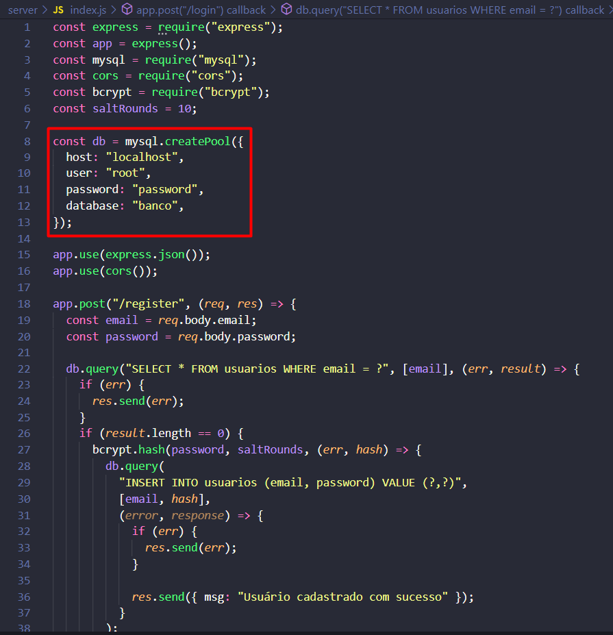

# React-JS--Login-Register-MySQL

  

## Tutorial

  

  

## Installation

### Client

  1. `$ cd client`
  2. `$ npm install` or `$ yarn install`
  3. `$ npm start` or `$ yarn start`
  
### Server

  1. Change your mySQL database data `server/index.js`
  
  

    
  

  
  
  2. `$ cd server`
  3. `$ npm install` or `$ yarn`
  4. `$ npm rum devStart`

## Functionalities

+ Register user with encrypted password.
+ Check to not allow the same user to register twice.
+ Verification of email and encrypted password to login

## Used Libraries

### Front-end
+ `formik` 
+ `yup` 
+ `axios` 

### Back-end

+ `bcrypt ` 
+ `express`
+ `mysql`
+ `nodemon`
